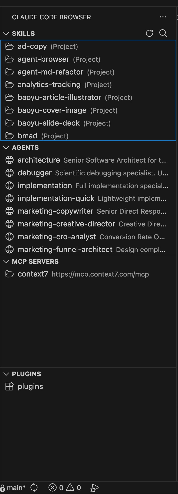

# Claude Code Browser

[](https://marketplace.visualstudio.com/items?itemName=chase-bowers.claude-code-browser)
[](https://opensource.org/licenses/MIT)

A VS Code extension that provides a sidebar panel for discovering and invoking your Claude Code resources — skills, agents, MCP servers, and plugins — all in one place.



## Why This Extension?

If you use [Claude Code](https://docs.anthropic.com/en/docs/claude-code) (Anthropic's CLI for Claude), you've probably accumulated skills, agents, and MCP servers across your system. This extension gives you a visual browser to:

- **Discover** what resources you have available
- **See at a glance** which are global vs. project-specific
- **Invoke** them with a single click

No more remembering slash command names or digging through directories.

## Features

### Skills Browser
Browse all your Claude Code skills from both global (`~/.claude/skills/`) and project-local (`.claude/skills/`) directories.

- See skill name and description
- Visual indicator for global (🌐) vs project (📁) scope
- Click to copy the `/skill-name` command to clipboard

### Agents Browser
View your custom agents from `~/.claude/agents/`.

- See agent name and description
- One-click to copy the agent invocation command

### MCP Servers
See all configured MCP (Model Context Protocol) servers from your `.claude/.mcp.json` config.

- View server name and URL/command
- Quick reference without opening config files

### Plugins
Browse installed plugins from `~/.claude/plugins/`.

- View plugin metadata
- See what's available at a glance

### Common Features
- **Search/Filter**: Use the search icon to filter resources across all categories
- **Refresh**: Click refresh to rescan directories for new resources
- **Scope Badges**: Instantly see if a resource is global or project-specific

## Installation

### From VSIX (Recommended)

1. Download the latest `.vsix` file from [Releases](https://github.com/Bowers-Enterprises/claude-code-browser/releases)
2. Install via one of these methods:
   - **Drag and drop** the `.vsix` file into VS Code
   - **Command line**: `code --install-extension claude-code-browser-0.1.0.vsix`
   - **VS Code**: `Cmd+Shift+P` → "Extensions: Install from VSIX..."

### From Source

```bash
git clone https://github.com/Bowers-Enterprises/claude-code-browser.git
cd claude-code-browser
npm install
npm run compile
npm run package
code --install-extension claude-code-browser-0.1.0.vsix
```

## Usage

1. **Open the sidebar**: Click the Claude Code Browser icon in the Activity Bar (left side)
2. **Browse resources**: Expand the Skills, Agents, MCP Servers, or Plugins sections
3. **Invoke a resource**: Click any item to copy its command to your clipboard
4. **Paste into Claude Code**: Press `Cmd+V` in the Claude Code chat input

### Keyboard Shortcuts

| Action | Shortcut |
|--------|----------|
| Search/Filter | Click 🔍 in section header |
| Refresh | Click 🔄 in section header |

## Configuration

The extension automatically discovers resources from these locations:

| Resource Type | Global Location | Project Location |
|--------------|-----------------|------------------|
| Skills | `~/.claude/skills/` | `.claude/skills/` |
| Agents | `~/.claude/agents/` | — |
| MCP Servers | — | `.claude/.mcp.json` |
| Plugins | `~/.claude/plugins/` | — |

No additional configuration required.

## Known Limitations

- **Clipboard-based invocation**: Due to VS Code extension sandboxing, we cannot directly inject text into the Claude Code chat input. The extension copies commands to your clipboard for pasting.
- **MCP Servers**: Only reads from project-level `.mcp.json`, not global config.

## Development

### Prerequisites

- Node.js 18+
- VS Code 1.85+

### Setup

```bash
git clone https://github.com/Bowers-Enterprises/claude-code-browser.git
cd claude-code-browser
npm install
```

### Build & Test

```bash
# Compile TypeScript
npm run compile

# Watch mode
npm run watch

# Package extension
npm run package
```

### Debug

Press `F5` in VS Code to launch the Extension Development Host with the extension loaded.

## Contributing

Contributions are welcome! Please see [CONTRIBUTING.md](CONTRIBUTING.md) for guidelines.

## License

MIT License - see [LICENSE](LICENSE) for details.

## Credits

Built with ❤️ for the Claude Code community.

---

**Not affiliated with Anthropic.** Claude Code is a product of Anthropic, PBC.
